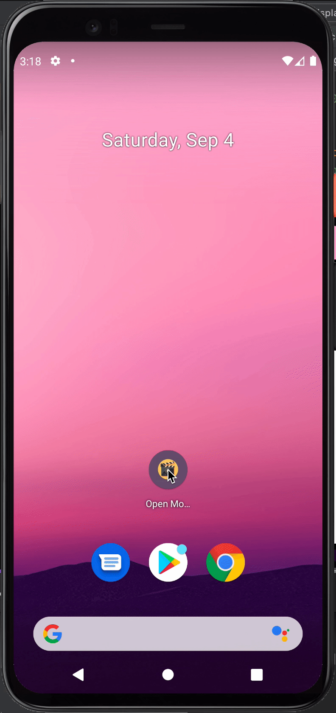

# openMovie

Show case Android practices using [the Movie db](https://www.themoviedb.org/)

&nbsp;&nbsp;&nbsp;&nbsp;&nbsp;&nbsp;&nbsp;&nbsp;  &nbsp;&nbsp;&nbsp;&nbsp;&nbsp;&nbsp;&nbsp;&nbsp; 

## Tech stack
- 100% testable Kotlin code
- Clean Multimodular Architecture
- Presentation layer built based on Unidirectional data flow (UDF) and single entry points
- Latest AGP 7+
- Dagger Hilt
- CI with Github actions
- High test coverage using Unit, Instrumentation and Integration tests

## Architecture

#### Multi modular project structure
This project aims for showcasing a multi modular architecture based on 2 concepts: Libraries and Features

- **Features** contains all user facing functionality (e.g. Discover, Movie Details)
- **Libraries** are shared modules that help the building of features (e.g. network,  ui, test)

#### CI
In addition to static analysis and unit tests we are using a test matrix for each commit on master. and triggering all instrumentation tests for different API lvls 

#### Testing strategy

The data layer is tested through a combination of unit tests + Mockwebserver in order to fully test Retrofit network integrations. By following  this approach we are covering:
-  Retrofit instance
-  Json converters, in this case Kotlin Serialization converters
- Network data sources 

The main idea is to make sure that the whole network integration is working before starting to implement other areas of the application. 

[I've wrote an article explaining how this works in more depth](https://proandroiddev.com/testing-retrofit-converter-with-mock-webserver-50f3e1f54013)

For the domain layer the tests are standard unit  tests focusing on outcome not implementation and using the correct test double for each case. Avoiding unecessary mocking of classes is proven to make unit tests faster. There's a good article about when to mock from uncle bob [here](https://blog.cleancoder.com/uncle-bob/2014/05/10/WhenToMock.html)

Finally the presentation layer is tested using the following strategy
- Unit tests for VMs and mappers. Here mocks are used to cover the architectural boundaries (VM and Use cases)
- Instrumentation tests for UI. For those types of tests, the approach used is based [Testing Robots](https://jakewharton.com/testing-robots/)
